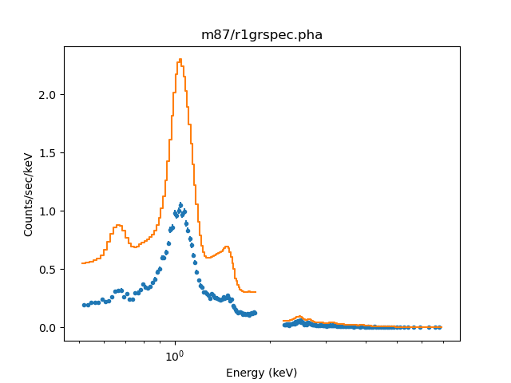
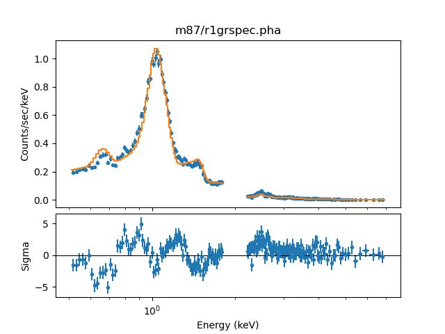
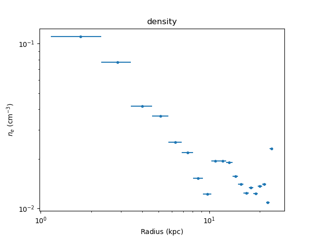
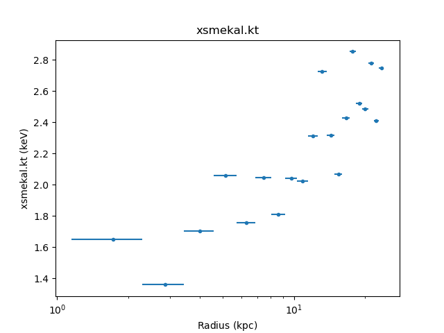
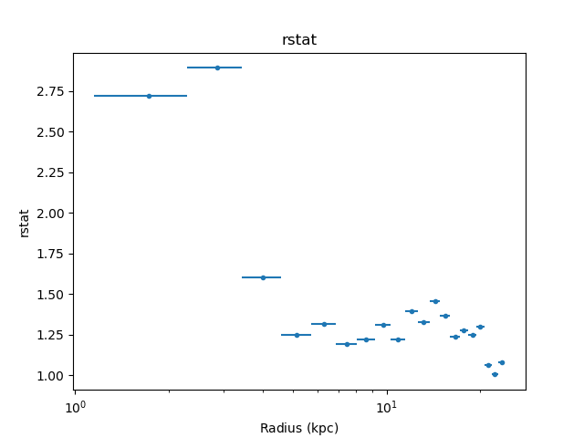
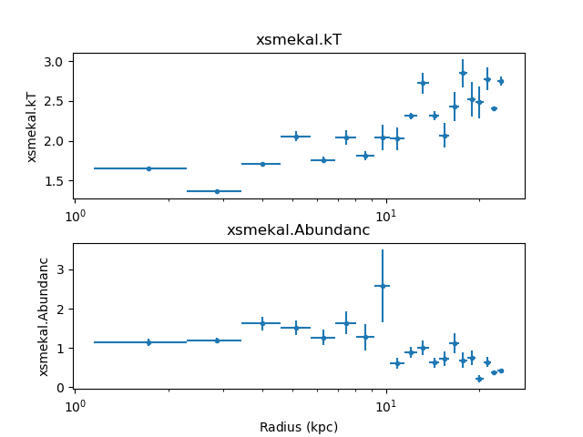
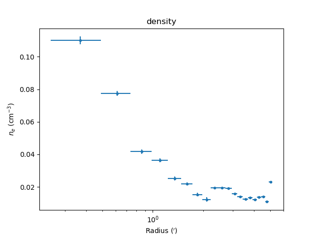
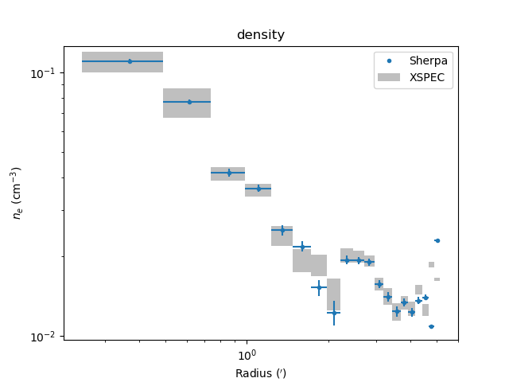
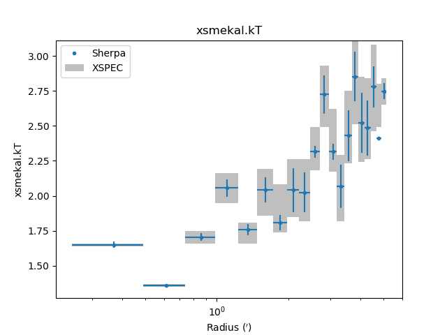

.. include:: ../references.rst

***
M87
***

Now we step through in detail the ``fit_m87.py`` script in the ``examples``
directory to explain each step and illustrate how to use the :mod:`deproject`
module.  This script should serve as the template for doing your own analysis.

This example uses extracted spectra, response products, and analysis results
for the Chandra observation of M87 (obsid 2707).  These were kindly provided
by Paul Nulsen.  Results based on this observation can be found in
`Forman et al 2005`_
and via the CXC Archive `Obsid 2707 Publications`_ list.

.. _`Forman et al 2005`: https://ui.adsabs.harvard.edu/?#abs/2005ApJ...635..894F
.. _`Obsid 2707 Publications`: https://cda.harvard.edu/chaser/viewerContents.do?obsid=2707&operation=ads

The examples assume this is being run directly from the Sherpa shell,
which has already imported the Sherpa module. If you are using IPython
or a Jupyter notebook then the following command is needed:

  >>> from sherpa.astro.ui import *

Set up
======

The first step is to load in the Deproject class::

  >>> from deproject import Deproject

and then set a couple of constants (note that both the angular-diameter
distance and thta values *must* be
`Astropy quantites <http://docs.astropy.org/en/stable/units/>`_)::

  >>> from astropy import units as u
  >>> redshift = 0.004233                     # M87 redshift
  >>> angdist = 16 * u.Mpc                    # M87 distance
  >>> theta = 75 * u.deg                      # Covering angle of sectors

Next we create an  array of the the annular radii in arcsec. The
`numpy.arange`_ method here returns an array from 30 to 640 in steps of 30.
These values were in pixels in the original spectral extraction so we
multiply by the pixel size (0.492 arcseconds) to convert to an angle.::

  >>> radii = numpy.arange(30., 640., 30) * 0.492 * u.arcesc

The ``radii`` parameter must be a list of values that starts with the inner
radius of the inner annulus and includes each radius up through the outer
radius of the outer annulus.  Thus the ``radii`` list will be one element
longer than the number of annuli.

::

  >>> print(radii)
  [ 14.76  29.52  44.28  59.04  73.8   88.56 103.32 118.08 132.84 147.6
   162.36 177.12 191.88 206.64 221.4  236.16 250.92 265.68 280.44 295.2
   309.96] arcsec

*Now the key step* of creating the :class:`Deproject` object ``dep``.  This
object is the interface to the all the :mod:`deproject`
methods used for the deprojection analysis.
::

  >>> dep = Deproject(radii, theta=theta, angdist=angdist)

If you are not familiar with object oriented programming, the ``dep`` object is
just a thingy that stores all the information about the deprojection analysis
(e.g. the source redshift, PHA file information and the source model
definitions) as object *attributes*.  It also has object *methods*
(i.e. functions) you can call such as ``dep.get_par(parname)`` or
``dep.load_pha(file)``.  The full list of attributes and methods are in the
:mod:`deproject` module documentation.

In this particular analysis the spectra were extracted from a 75
degree sector of the annuli, hence ``theta`` is set in the object
initialization, where the units are set explicitly using the
`Astropy support for units <http://docs.astropy.org/en/stable/units/>`_.
Note that this parameter only needs to be set if any of the
annuli are sectors rather than the full circle.
Since the redshift is **not** a good distance
estimator for M87 we also explicitly set the angular size distance
using the ``angdist`` parameter.

.. _m87_load:

Load the data
=============

Now load the PHA spectral files for each annulus using the Python ``range``
function to loop over a sequence ranging from 0 to the last annulus.  The
:py:meth:`~deproject.deproject.Deproject.load_pha`
call is the first example of a :mod:`deproject` method
(i.e. function) that mimics a *Sherpa* function with the same name.  In this
case ``dep.load_pha(file, annulus)`` loads the PHA file using the
*Sherpa* `load_pha`_
function but also registers the dataset in the spectral stack::

  >>> for annulus in range(len(radii) - 1):
  ...    dep.load_pha(f'm87/r{annulus + 1}grspec.pha', annulus)

.. note::
   The ``annulus`` parameter is required in ``dep.load_pha()`` to allow
   multiple data sets per annulus, such as repeated Chandra observations
   or different XMM instruments.

Create the model
================

With the data loaded we set the source model for each of the spherical shells
with the
:py:meth:`~deproject.deproject.Deproject.set_source`
method.  This is one of the more complex bits of
:mod:`deproject`.  It automatically generates all the model components for each
shell and then assigns volume-weighted linear combinations of those components
as the source model for each of the annulus spectral datasets::

  >>> dep.set_source('xswabs * xsmekal')

The model expression can be any valid *Sherpa* model expression with the
following caveats:

 - Only the generic model type should be specified in the expression.  In
   typical *Sherpa* usage one generates the model component name in the
   model expression, e.g. ``set_source('xswabs.abs1 * xsmekal.mek1')``.  This
   would create model components named ``abs1`` and ``mek1``.  In
   ``dep.set_source()`` the model component names are auto-generated as
   ``<model_type>_<shell>``.
 - Only one of each model type can be used in the model expression.  A source
   model expression like ``"xsmekal + gauss1d + gauss1d"`` would result in an
   error due to the model component auto-naming.

Next any required parameter values are set and their `freeze`_ or `thaw`_
status are set.
::

  >>> dep.set_par('xswabs.nh', 0.0255)
  >>> dep.freeze('xswabs.nh')

  >>> dep.set_par('xsmekal.abundanc', 0.5)
  >>> dep.thaw('xsmekal.abundanc')

  >>> dep.set_par('xsmekal.redshift', redshift)

As a convenience if any of the model components have a
``redshift`` parameter that value will be used as the default redshift for
calculating the angular size distance.

.. _data_selection:

Define the data to fit
======================

Now the energy range used in the fitting is restricted using the stack version
of the *Sherpa* `ignore`_ command.  The `notice`_ command is also available.
::

  >>> dep.ignore(None, 0.5)
  >>> dep.ignore(1.8, 2.2)
  >>> dep.ignore(7, None)

Define the optimiser and statistic
==================================

At this point the model is completely set up and we are ready to do the initial
"onion-peeling" fit.  As for normal high-signal fitting with binned spectra we
issue the commands to set the optimization method and the fit statistic.

In this case we use the Levenberg-Marquardt optimization method with
the :math:`\chi^2` fit statistic, where the variance is estimated
using a similar approach to XSPEC.

::

  >>> set_method("levmar")
  >>> set_stat("chi2xspecvar")
  >>> dep.subtract()

.. note::
   The ``chi2xspecvar`` statistic is used since the values will be
   :ref:`compared to results from XSPEC <m87_compare>`.

Seeding the fit
===============

We first try to "guess" a good starting point for the fit (since the
default fit parameters, in particular the normalization, are often
not close to the expected value). In this case the
:py:meth:`~deproject.deproject.Deproject.guess`
method implements a scheme suggested in the `projct`_ documentation, which
fits each annulus with an un-projected model and then corrects the
normalizations for the shell/annulus overlaps:

  >>> dep.guess()
  Projected fit to annulus 19 dataset: 19
  Dataset               = 19
  ...
  Change in statistic   = 4.60321e+10
     xsmekal_19.kT   2.748        +/- 0.0551545
     xsmekal_19.Abundanc   0.429754     +/- 0.0350466
     xsmekal_19.norm   0.00147471   +/- 2.45887e-05
  Projected fit to annulus 18 dataset: 18
  Dataset               = 18
  ...
  Change in statistic   = 4.61945e+10
     xsmekal_18.kT   2.68875      +/- 0.0543974
     xsmekal_18.Abundanc   0.424198     +/- 0.0335045
     xsmekal_18.norm   0.00147443   +/- 2.43454e-05
  ...
  Projected fit to annulus 0 dataset: 0
  Dataset               = 0
  ...
  Change in statistic   = 2.15043e+10
     xsmekal_0.kT   1.57041      +/- 0.0121572
     xsmekal_0.Abundanc   1.05816      +/- 0.0373779
     xsmekal_0.norm   0.00152496   +/- 2.93297e-05

As shown in the screen output, the ``guess`` routine fits each
annulus in turn, from outer to inner. After each fit, the
normalization (the ``xsmekal_*.norm`` terms) are adjusted by
the filling factor of the shell.

.. note::
   The ``guess`` step is *optional*. Parameter values can also be set,
   either for an individual annulus with the Sherpa `set_par`_ function,
   such as::

     set_par('xsmekal_0.kt', 1.5)

   or to all annuli with the Deproject method
   :py:meth:`~deproject.deproject.Deproject.set_par`::

     dep.set_par('xsmekal.abundanc', 0.3)

The data can be inspected using normal Sherpa commands. The
following shows the results of the guess for dataset 0,
which corresponds to the inner-most annulus (the
:py:attr:`~deproject.deproject.Deproject.datasets` attribute
can be used to map between annuus and dataset identifier).

::

  >>> set_xlog()
  >>> plot_fit(0)

The overall shape of the model looks okay, but the normalization is
not (since it has been adjusted by the volume-filling factor of the
intersection of the annulus and shell).  The gap in the data around 2
keV is because we :ref:`explicitly excluded this range
<data_selection>` from the fit.

.. note::
   The :py:class:`~deproject.deproject.Deproject` class also provides
   methods for plotting each annulus in a separate window, such as
   :py:meth:`~deproject.deproject.Deproject.plot_data`
   and
   :py:meth:`~deproject.deproject.Deproject.plot_fit`.

   The plot output depends on the version of Sherpa in use (prior to
   the 4.13 release the models were not displayed as histograms and
   the filtered-out ranges were not so obvious as they now are).

Fitting the data
================

The
:py:meth:`~deproject.deproject.Deproject.fit`
method performs the full onion-skin deprojection (the output
is similar to the ``guess`` method, with the addition of
parameters being frozen as each annulus is processed)::

  >>> onion = dep.fit()
  Fitting annulus 19  dataset: 19
  Dataset               = 19
  ...
  Reduced statistic     = 1.07869
  Change in statistic   = 1.29468e-08
     xsmekal_19.kT   2.748        +/- 0.0551534
     xsmekal_19.Abundanc   0.429758     +/- 0.0350507
     xsmekal_19.norm   0.249707     +/- 0.00416351
  Freezing xswabs_19
  Freezing xsmekal_19
  Fitting annulus 18  dataset: 18
  Dataset               = 18
  ...
  Reduced statistic     = 1.00366
  Change in statistic   = 13444.5
     xsmekal_18.kT   2.41033      +/- 0.274986
     xsmekal_18.Abundanc   0.375824     +/- 0.136926
     xsmekal_18.norm   0.0551815    +/- 0.00441495
  Freezing xswabs_18
  Freezing xsmekal_18
  ...
  Freezing xswabs_1
  Freezing xsmekal_1
  Fitting annulus 0  dataset: 0
  Dataset               = 0
  ...
  Reduced statistic     = 2.72222
     xsmekal_0.kT   1.64884      +/- 0.0242336
     xsmekal_0.Abundanc   1.14629      +/- 0.0903398
     xsmekal_0.norm   5.68824      +/- 0.245884
  ...

The fit to the central annulus (dataset 0) now looks like::

  >>> plot_fit_delchi(0)

After the fit process each shell model has an association normalization that
can be used to calculate the densities.  This is where the source angular
diameter distance is used.  If the angular diameter distance is not set
explicitly in the original ``dep = Deproject(...)`` command then it is
calculated automatically from the source redshift and an assumed Cosmology,
which if not set is taken to be the
`Planck15 model <http://docs.astropy.org/en/stable/cosmology/index.html#built-in-cosmologies>`_
provided by the
`astropy.cosmology <http://docs.astropy.org/en/stable/cosmology/>`_
module.

One can examine the values being used as follows (note that the
:py:attr:`~deproject.deproject.Deproject.angdist` attribute is an
`Astropy Quantity <http://docs.astropy.org/en/stable/units/>`_)::

  >>> print("z={:.5f} angdist={}".format(dep.redshift, dep.angdist))
  z=0.00423 angdist=16.0 Mpc

New in version 0.2.0 is the behavior of the ``fit`` method, which now
returns an Astropy table which tabulates the fit results as a function
of annulus. This *includes* the electron density, which can also be
retrieved with
:py:meth:`~deproject.deproject.Deproject.get_density`.
The fit results can also be retrieved with the
:py:meth:`~deproject.deproject.Deproject.get_fit_results`
method.

::

  >>> print(onion)
  annulus rlo_ang rhi_ang ...     xsmekal.norm          density
           arcsec  arcsec ...                           1 / cm3
  ------- ------- ------- ... ------------------- --------------------
        0   14.76   29.52 ...  5.6882389946381275   0.1100953546292787
        1   29.52   44.28 ...  2.8089409208987233  0.07736622021374819
        2   44.28   59.04 ...   0.814017947154132  0.04164827967805805
        3   59.04    73.8 ...  0.6184339453006981  0.03630168106524076
        4    73.8   88.56 ...  0.2985327157676323 0.025221797991301052
        5   88.56  103.32 ... 0.22395312678845017 0.021845331641349316
      ...     ...     ... ...                 ...                  ...
       13  206.64   221.4 ... 0.07212121560592619 0.012396857131392835
       14   221.4  236.16 ... 0.08384338967492334  0.01336640115325031
       15  236.16  250.92 ... 0.07104455447410102 0.012303975980575187
       16  250.92  265.68 ... 0.08720295254137615 0.013631563529090736
       17  265.68  280.44 ... 0.09192970392746878 0.013996131292837352
       18  280.44   295.2 ... 0.05518150227052414 0.010843683594144967
       19   295.2  309.96 ... 0.24970680803387219 0.023067220584935984
  Length = 20 rows

Inspecting the results
======================

The electron density can be retrieved directly from the fit results,
with the
:py:meth:`~deproject.deproject.Deproject.get_density`
method::

  >>> print(dep.get_density())
  [ 0.11009535  0.07736622  0.04164828  0.03630168  0.0252218   0.02184533
    0.01525456  0.01224972  0.01942528  0.01936785  0.01905983  0.01568478
    0.01405426  0.01239686  0.0133664   0.01230398  0.01363156  0.01399613
    0.01084368  0.02306722] 1 / cm3

or plotted using
:py:meth:`~deproject.deproject.Deproject.density_plot`::

  >>> dep.density_plot()

.. _m87_ringing:

The temperature profile from the deprojection can be plotted using
:py:meth:`~deproject.deproject.Deproject.par_plot`::

  >>> dep.par_plot('xsmekal.kt')

The unphysical temperature oscillations seen here highlights a known issue
with this analysis method (e.g. `Russell, Sanders, & Fabian 2008`_).

It can also be instructive to look at various results from the fit,
such as the reduced statistic for each annulus (as will be shown
below, there are
:py:meth:`~deproject.deproject.Deproject.fit_plot`,
:py:meth:`~deproject.deproject.Deproject.conf_plot`,
and
:py:meth:`~deproject.deproject.Deproject.covar_plot` variants)::

  >>> dep.fit_plot('rstat')

Error analysis
==============

Errors can also be calculated, on both the model parameters and the
derived densities, with either the
:py:meth:`~deproject.deproject.Deproject.conf`
or
:py:meth:`~deproject.deproject.Deproject.covar`
methods. These
apply the confidence and covariance error-estimation routines from
Sherpa using the same onion-skin model used for the fit, and are new
in version 0.2.0. In this example we use the covariance version, since
it is generally faster, but confidence is the recommended routine as it
is more robust (and calculates asymmetric errors)::

  >>> errs = dep.covar()

As with the ``fit`` method, both ``conf`` and ``covar`` return the results
as an Astropy table. These can also be retrieved with the
:py:meth:`~deproject.deproject.Deproject.get_conf_results`
or
:py:meth:`~deproject.deproject.Deproject.get_covar_results`
methods. The columns depend on the command (i.e. fit or error results)::

  >>> print(errs)
  annulus rlo_ang rhi_ang ...        density_lo             density_hi
           arcsec  arcsec ...         1 / cm3                1 / cm3
  ------- ------- ------- ... ----------------------- ----------------------
        0   14.76   29.52 ...  -0.0023299300992805777  0.0022816336635322065
        1   29.52   44.28 ...  -0.0015878693875514133  0.0015559288091097495
        2   44.28   59.04 ...  -0.0014852395638492444  0.0014340671599212054
        3   59.04    73.8 ...  -0.0011539611188859725    0.00111839214283211
        4    73.8   88.56 ...   -0.001166653616914693   0.001115024462355424
        5   88.56  103.32 ...  -0.0010421595234548324  0.0009946565126391325
      ...     ...     ... ...                     ...                    ...
       13  206.64   221.4 ...  -0.0005679816551559976  0.0005430748019680798
       14   221.4  236.16 ... -0.00048083556526315463 0.00046412880973027357
       15  236.16  250.92 ...  -0.0004951659664768401 0.00047599490797040934
       16  250.92  265.68 ...  -0.0004031089363366082  0.0003915259159180066
       17  265.68  280.44 ...  -0.0003647519140328147 0.00035548459401609986
       18  280.44   295.2 ...                     nan                    nan
       19   295.2  309.96 ... -0.00019648511719753958 0.00019482554589523096
  Length = 20 rows

.. note::
   With this set of data, the covariance method failed to calculate errors
   for the parameters of the last-but one shell, which is indicated by
   the presence of `NaN` values in the error columns.

The fit or error results can be plotted as a function of radius with the
:py:meth:`~deproject.deproject.Deproject.fit_plot`,
:py:meth:`~deproject.deproject.Deproject.conf_plot`,
and
:py:meth:`~deproject.deproject.Deproject.covar_plot`
methods (the latter two include error bars). For example, the
following plot mixes these plots with Matplotlib commands to
compare the temperature and abundance profiles::

  >>> plt.subplot(2, 1, 1)
  >>> dep.covar_plot('xsmekal.kt', clearwindow=False)
  >>> plt.xlabel('')
  >>> plt.subplot(2, 1, 2)
  >>> dep.covar_plot('xsmekal.abundanc', clearwindow=False)
  >>> plt.subplots_adjust(hspace=0.3)

The derived density profile, along with errors, can also be
displayed (the X axis is displayed using angular units rather
than as a length)::

  >>> dep.covar_plot('density', units='arcmin')

.. _m87_compare:

Comparing results
=================

In the images below the :mod:`deproject` results (blue) are compared with
values (gray boxes) from an independent onion-peeling analysis by P. Nulsen
using a custom perl script to generate `XSPEC`_ model definition and fit
commands.  These plots were created with the ``plot_m87.py`` script in
the ``examples`` directory.  The agreement is good (note that the version
of XSPEC used for the two cases does not match):

