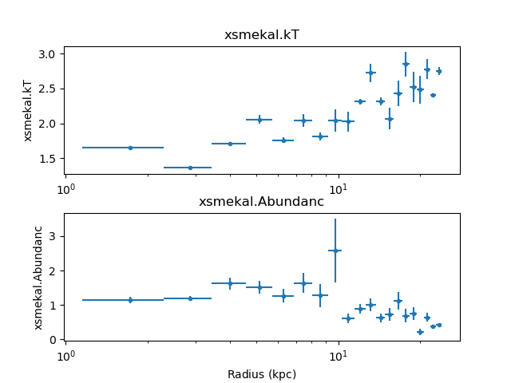

.. include:: ../references.rst

****************
Combining shells
****************

We now look at tie-ing parameters from different annuli (that is,
forcing the temperature or abundance of one shell to be the
same as a neighbouring shell), which is a technique used to
try and reduce the "ringing" that can be seen in deprojected
data (e.g. `Russell, Sanders, & Fabian 2008`_ and seen in
the :ref:`temperature profile of the M87 data <m87_ringing>`).
Sherpa supports complicated links between model parameters
with the `link`_ and `unlink`_ functions, and the
Deproject class provides helper methods -
:py:meth:`~deproject.deproject.Deproject.tie_par`
and
:py:meth:`~deproject.deproject.Deproject.untie_par`
- that allows you to easily tie together annuli.

Starting from where the :doc:`m87` example left off,
we have:

The :py:meth:`~deproject.deproject.Deproject.get_shells`
method lists the current set of annuli, and show that there
are currently no grouped (or tied-together) annuli:

  >>> dep.get_shells()
  [{'annuli': [19], 'dataids': [19]},
   {'annuli': [18], 'dataids': [18]},
   {'annuli': [17], 'dataids': [17]},
   {'annuli': [16], 'dataids': [16]},
   {'annuli': [15], 'dataids': [15]},
   {'annuli': [14], 'dataids': [14]},
   {'annuli': [13], 'dataids': [13]},
   {'annuli': [12], 'dataids': [12]},
   {'annuli': [11], 'dataids': [11]},
   {'annuli': [10], 'dataids': [10]},
   {'annuli': [9], 'dataids': [9]},
   {'annuli': [8], 'dataids': [8]},
   {'annuli': [7], 'dataids': [7]},
   {'annuli': [6], 'dataids': [6]},
   {'annuli': [5], 'dataids': [5]},
   {'annuli': [4], 'dataids': [4]},
   {'annuli': [3], 'dataids': [3]},
   {'annuli': [2], 'dataids': [2]},
   {'annuli': [1], 'dataids': [1]},
   {'annuli': [0], 'dataids': [0]}]
  
For this example we are going to see what happens when we
tie together the temperature and abundance of annulus 17 and 18
(the inner-most annulus is numbered 0, the outer-most is 19 in this
example).

  >>> dep.tie_par('xsmekal.kt', 17, 18)
  Tying xsmekal_18.kT to xsmekal_17.kT
  >>> dep.tie_par('xsmekal.abundanc', 17, 18) 
  Tying xsmekal_18.Abundanc to xsmekal_17.Abundanc

Looking at the first few elements of the list returned by `get_shells`
shows us that the two annuli have now been grouped together. This
means that when a fit is run then these two annuli will be
fit simultaneously.

  >>> dep.get_shells()[0:5]
  [{'annuli': [19], 'dataids': [19]},
   {'annuli': [17, 18], 'dataids': [17, 18]},
   {'annuli': [16], 'dataids': [16]},
   {'annuli': [15], 'dataids': [15]},
   {'annuli': [14], 'dataids': [14]}]

Since the model values for the 18th annulus have been changed, the
data needs to be re-fit. The screen output is slightly different,
as highlighted below, to reflect this new grouping:

  >>> dep.fit()
  Note: annuli have been tied together
  Fitting annulus 19  dataset: 19
  Dataset               = 19
  ...
  Freezing xswabs_19
  Freezing xsmekal_19
  Fitting annuli [17, 18]  datasets: [17, 18]
  Datasets              = 17, 18
  Method                = levmar
  Statistic             = chi2xspecvar
  Initial fit statistic = 469.803
  Final fit statistic   = 447.963 at function evaluation 16
  Data points           = 439
  Degrees of freedom    = 435
  Probability [Q-value] = 0.323566
  Reduced statistic     = 1.0298
  Change in statistic   = 21.8398
     xsmekal_17.kT   2.64505      +/- 0.0986876   
     xsmekal_17.Abundanc   0.520943     +/- 0.068338    
     xsmekal_17.norm   0.0960039    +/- 0.00370363  
     xsmekal_18.norm   0.0516096    +/- 0.00232468  
  Freezing xswabs_17
  Freezing xsmekal_17
  Freezing xswabs_18
  Freezing xsmekal_18
  Fitting annulus 16  dataset: 16
  ...

The table returned by :py:meth:`~deproject.deproject.Deproject.fit`
and :py:meth:`~deproject.deproject.Deproject.get_fit_results`
still contains 20 rows, since each annulus has its own row:

  >>> tied = dep.get_fit_results()
  >>> len(tied)
  20

Looking at the outermost annuli, we can see that the temperature
and abundance values are the same:

  >>> print(tied['xsmekal.kT'][16:])
      xsmekal.kT    
  ------------------
  2.5470334673573936
   2.645045455995055
   2.645045455995055
  2.7480050952727346
  >>> print(tied['xsmekal.Abundanc'][16:])
    xsmekal.Abundanc 
  -------------------
  0.24424232427701525
   0.5209430839965413
   0.5209430839965413
   0.4297577517591726

.. note::
   The field names in the table are case sensitive - that is, you
   have to say ``xsmekal.kT`` and not ``xsmekal.kt`` - unlike the
   Sherpa parameter interface.

The results can be compared to the original, such as in the
following plot, which shows that the temperature profile hasn't
changed significantly in the core, but some of the oscillations
at large radii have been reduced (the black circles show the
temperature values from the original fit):

   >>> dep.fit_plot('xsmekal.kt', units='pc')
   >>> rmid = (onion['rlo_phys'] + onion['rhi_phys']) / 2
   >>> plt.scatter(rmid.to(u.pc), onion['xsmekal.kT', c='k')

.. image:: m87_temperature_tied_comparison.png
	   
.. note::
   As the X-axis of the plot created by
   :py:meth:`~deproject.deproject.Deproject.fit_plot` is in pc, the
   ``rmid`` value is expliclty converted to these units before
   plotting.

   The ``results`` parameter of ``fit_plot`` could have been set
   to the variable ``onion`` to display the results of the previous fit,
   but there is no easy way to change the color of the points.

More shells could be tied together to try and further
reduce the oscillations, or errors calculated, with either
:py:meth:`~deproject.deproject.Deproject.conf`
or    
:py:meth:`~deproject.deproject.Deproject.covar`.
   
The parameter ties can be removed with
:py:meth:`~deproject.deproject.Deproject.untie_par`:

  >>> dep.untie_par('xsmekal.kt', 18)
  Untying xsmekal_18.kT
  >>> dep.untie_par('xsmekal.abundanc', 18)
  Untying xsmekal_18.Abundanc
  >>> dep.get_shells()[0:4]
  [{'annuli': [19], 'dataids': [19]},
   {'annuli': [18], 'dataids': [18]},
   {'annuli': [17], 'dataids': [17]},
   {'annuli': [16], 'dataids': [16]}]
  
