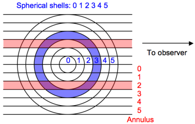
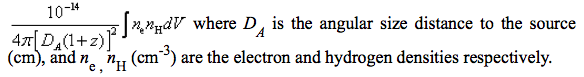
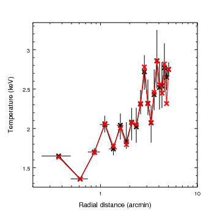

.. deproject documentation master file, created by sphinx-quickstart on Sat Jan 31 15:06:12 2009.
   You can adapt this file completely to your liking, but it should at least
   contain the root `toctree` directive.

.. _`CIAO`: http://cxc.harvard.edu/ciao/
.. _`sherpa`: http://cxc.harvard.edu/sherpa/
.. _`XSPEC`: http://heasarc.gsfc.nasa.gov/docs/xanadu/xspec/
.. _`projct`: https://astrophysics.gsfc.nasa.gov/XSPECwiki/projct_model
.. _`freeze`: http://cxc.harvard.edu/sherpa/ahelp/freeze.py.html
.. _`set_par`: http://cxc.harvard.edu/sherpa/ahelp/set_par.py.html
.. _`set_source`: http://cxc.harvard.edu/sherpa/ahelp/set_source.py.html
.. _`ignore`: http://cxc.harvard.edu/sherpa/ahelp/ignore.py.html

deproject
====================

Overview
----------

:mod:`Deproject` is a `CIAO`_ `Sherpa`_ extension package to facilitate
deprojection of two-dimensional annular X-ray spectra to recover the
three-dimensional source properties.  This basic method (refs) has been
used extensively for X-ray cluster analysis and is the basis for the `XSPEC`_
model `projct`_.  The :mod:`deproject` module brings this functionality to
*Sherpa* as a Python module that is straightforward to use and understand.

The :mod:`deproject` module uses :mod:`specstack` to allow for manipulation of
a stack of related input datasets and their models.  Most of the functions are
just like ordinary *Sherpa* commands (e.g. `set_par`_, `set_source`_,
`ignore`_) but operate on a stack of spectra.

Download
---------
Here is how to download

Installation
-------------
Here is how to install

Concepts
-----------

The basic physical assumption of :mod:`deproject` is that the extended source
emissivity is constant and optically thin within spherical shells whose radii
correspond to the annuli used to extract the specta.  Given this assumption one
constructs a model for each annular spectrum that is a linear volume-weighted
combination of shell models.  The geometry is illustrated in the figure below
(which would be rotated about the line to the observer in three-dimensions):

Model creation
^^^^^^^^^^^^^^^
It is assumed that prior to starting :mod:`deproject` the user has extracted
source and background spectra for each annulus.  By convention the annulus
numbering starts from the inner radius at 0 and corresponds to the dataset
``id`` used within *Sherpa*.  It is not required that the annuli include the
center but they must be contiguous between the inner and outer radii.

Given a spectral model ``M[s]`` for each shell ``s``, the source model for
dataset ``a`` (i.e. annulus ``a``) is given by the sum over ``s >= a`` of
``vol_norm[s,a] * M[s]`` (normalized volume * shell model).  The image above
shows shell 3 in blue and annulus 2 in red.  The intersection of (purple) has a
physical volume defined as ``vol_norm[3,2] * v_sphere`` where ``v_sphere`` is the
volume of the sphere enclosing the outer shell.

The bookkeeping required to create all the source models is handled by the
:mod:`deproject` module.

Fitting
^^^^^^^^^^^
Once the composite source models for each dataset are created the fit analysis
can begin.  Since the parameter space is typically large the usual procedure is
to initally fit using the "onion-peeling" method:

 - First fit the outside shell model using the outer annulus spectrum
 - Freeze the model parameters for the outside shell
 - Fit the next inward annulus / shell and freeze those parameters
 - Repeat until all datasets have been fit and all shell parameters determined.

From this point the user may choose to do a simultanenous fit of the shell
models, possibly freezing some parameters as needed.  This process is made
manageable with the :mod:`specstack` methods that apply normal *Sherpa*
commands like `freeze`_ or `set_par`_ to a stack of spectral datasets.

Densities
^^^^^^^^^^^
Physical densities (cm^-3) for each shell can be calculated with
:mod:`deproject` assuming the source model is based on a thermal model with the
"standard" normalization (from the `XSPEC`_ documentation):

Inverting this equation and assuming a constant ratio of N_H to electrons::

 n_e = sqrt(norm * 4*pi * DA^2 * 1e14 * (1+z)^2 / volume * ne_nh_ratio))

 norm        = model normalization from Sherpa fit
 DA          = angular size distance (cm)
 volume      = volume (cm^3)
 ne_nh_ratio = 1.18

Recall that the model components for each volume element (intersection of the
annular cylinder ``a`` with the spherical shell ``s``) are multiplied by a volume
normalization::

 vol_norm[s,a] = v[s,a] / v_sphere
 v_sphere = volume of sphere enclosing outer annulus

With this convention the ``volume`` used above in calculating the electron
density for each shell is always ``v_sphere``.

Example: M87
------------------
The first thing we need to do is tell *Sherpa* about the Deproject class and
set a couple of constants::

  from deproject import Deproject

  redshift = 0.004233                     # M87 redshift
  arcsec_per_pixel = 0.492                # ACIS plate scale

Now we actually initialize the :class:`Deproject` object ``dep`` by passing a
`numpy`_ array of the the annular radii in arcsec.  The `numpy.arange`_ method
here returns an array from 30 to 640 in steps of 30.  These values were in
pixels in the original spectral extraction so we convert to arcsec.  (Note the
convenient vector multiplication that is possible with `numpy`_.)  

In this particular analysis the spectra were extracted from a 75 degree sector
of the annuli, hence ``theta=75`` in  the object initialization.  For the
default case of full 360 degree annuli this is not needed.::

  radii = numpy.arange(30., 640., 30) * arcsec_per_pixel
  dep = Deproject(radii, theta=75)

Now load the PHA spectral files for each annulus using the Python ``range``
function to loop over a sequence ranging from 0 to the last annulus.  The
``load_pha()`` call is the first example of a :mod:`deproject` method
(i.e. function) that mimics a *Sherpa* function with the same name.  In this
case ``dep.load_pha(file)`` loads the PHA file using the *Sherpa* `load_pha`_
function but also registers the dataset in the spectral stack.

  for annulus in range(len(radii)-1):
      dep.load_pha('m87/r%dgrspec.pha' % (annulus+1))

With the data loaded we set the source model for each of the spherical shells
with the ``set_source()` method.  This is one of the more complex bits of
:mod:`deproject`.  It automatically generates all the model components for each
shell and then assigns volume-weighted linear combinations of those components
as the source model for each of the annulus spectral datasets.::

  dep.set_source('xswabs * xsmekal')

The model expression can be any valid *Sherpa* model expression with the following
caveats:

 - Only the generic model type should be specified in the expression.  In
   typical *Sherpa* usage one generates the model component name in the
   model expression, e.g. ``set_source("xswabs.abs1 * xsmekal.mek1")``.  This
   would create model components named ``abs1`` and ``mek1``.  In
   ``dep.set_source()`` the model component names are auto-generated as 
   ``<model_type>_<shell>``.
 - Only one of each model type can be used in the model expression.  A source
   model expression like "xsmekal + gauss1d + gauss1d" would result in an error
   due to the model component auto-naming.

Now the energy range used in the fitting is restricted using the stack version
of the *Sherpa* `ignore`_ command.  The `notice`_ command is also available.

  dep.ignore(None, 0.5)
  dep.ignore(1.8, 2.2)
  dep.ignore(7, None)

Next any required parameter values are set and their `freeze`_ or `thaw`_
status are set.  

  dep.set_par('xswabs.nh', 0.0255)
  dep.freeze("xswabs.nh")
  
  dep.set_par('xsmekal.abundanc', 0.5)
  dep.thaw('xsmekal.abundanc')
  
  dep.set_par('xsmekal.redshift', redshift)

As a convenience if any of the model components have a 
``redshift`` parameter that value will be used as the default redshift for
calculating the angular size distance.  

At this point the model is completely set up and we are ready to do the initial
"onion-peeling" fit.  As for normal high-signal fitting with binned spectra we
issue the commands to set the optimization method, set the fit statistic, and
configure *Sherpa* to `subtract`_ the background when doing model fitting.
Finally the :mod:`deproject` ``fit()`` method is called to perform the fit.

  set_method("levmar")                    # Levenberg-Marquardt optimization method
  set_stat("chi2gehrels")                 # Gehrels Chi^2 fit statistic
  dep.subtract()
  dep.fit()

After the fit process each shell model has an association normalization that
can be used to calculate the densities.  This is where the source angular
diameter distance is used.  By default the angular diameter distance is
determined with :mod:`cosmocalc` using the redshift found as a source model
parameter.  This can be overridden in one of two ways.  First by setting the
redshift and relying on :mod:`cosmocalc` to determine the angular size distance:

  dep.redshift = 0.1234   # Set redshift
  print dep.angdist       # Angdist calculated using standard WMAP cosmology

The second way is to explicitly set the angular size distance in cm:

  dep.angdist = 1.2345e28

The electron density is then calculated with the ``get_density()`` method and
plotted in *Sherpa*:

  density_ne = dep.get_density()
  rad_arcmin = (dep.radii[:-1] + dep.radii[1:]) / 2.0 / 60.
  add_curve(rad_arcmin, density_ne)
  set_curve(['symbol.color', 'red', 'line.color', 'red'])
  set_plot_xlabel('Radial distance (arcmin)')
  set_plot_ylabel('Density (cm^{-3})')
  limits(X_AXIS, 0.2, 10)
  print_window('m87_density', ['format', 'png'])

In the image below the density computed with :mod:`deproject` is plotted in
red.  The white curve shows the density determined with an independent
onion-peeling analysis by P. Nulsen using a custom perl script to generate
`XSPEC`_ model definition and fit commands.  The agreement is good:

.. image:: m87_density.png

Likewise the temperature profile from the :mod:`deproject` analysis matches the
`XSPEC`_ analysis.

  kt = dep.get_par('xsmekal.kt')   # returns array of kT values
  add_window()
  add_curve(rad_arcmin, kt) 
  set_plot_xlabel('Radial distance (arcmin)')
  set_plot_ylabel('Density (cm^{-3})')

The unphysical temperature oscillations seen here highlights a known issue
with this analysis method.

Module documentation
====================

.. toctree::
   :maxdepth: 2

   deproject
   specstack
   cosmocalc
