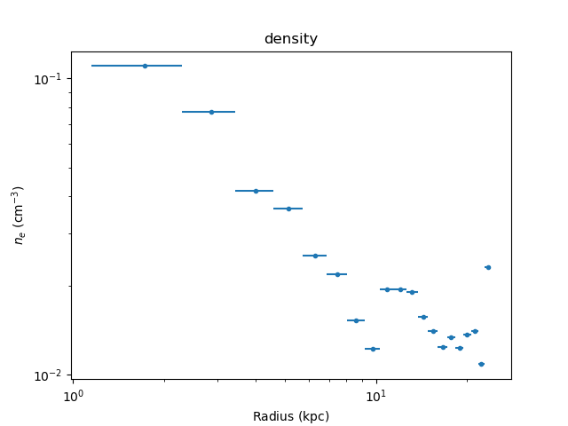

.. include:: references.rst

Installation
============

As of :ref:`version 0.2.0 <changes_020>`,
the :mod:`deproject` package can be installed
directly from `PyPI`_. This requires
`CIAO 4.11 <http://cxc.harvard.edu/ciao/>`_
or later (as installation with pip in earlier versions of
CIAO is not well supported). The module *can* be used with the
`standalone release of
Sherpa <https://sherpa.readthedocs.io/en/latest/ciao.html>`_,
but it is only useful if Sherpa has been built with
`XSPEC support <https://sherpa.readthedocs.io/en/latest/install.html#xspec>`_
which is trickier to achieve than we would like.

Requirements
------------

The package uses `Astropy`_ and `SciPy`_, for units support and
cosmological-distance calculations. It is assumed that
`Matplotlib`_ is available for plotting.

Installation is easier with CIAO 4.12 than CIAO 4.11 since
CIAO 4.12 is available via conda (so there is less need to
use a constraints file).

Using pip
---------

It should be as simple as starting the CIAO environment - this
depends on whether CIAO was installed via `ciao-install` or
`conda` - and then saying::

  pip install deproject

This approach should also work if you are using the standalone
version of Sherpa.

If you are using CIAO 4.11 then you should install `deproject`
with the following::

  echo "numpy==1.12.1" > constraints.txt
  pip install -c constraints.txt 'astropy<3.1' deproject

.. note::
   The Astropy restriction is because version 3.1 requires NumPy version
   1.13 or later but CIAO 4.11 is shipped with NumPy version 1.12.

Manual installation
-------------------

The source is available on github at
`<https://github.com/sherpa-deproject/deproject>`_, with releases available
at `<https://github.com/sherpa-deproject/deproject/releases>`_.

After downloading the source code (whether from a release or
by cloning the repository) and moving into the directory
(`deproject-<version>` or `deproject`), installation just
requires::

  python setup.py install

.. note::
   This command should only be run after setting up CIAO or whatever
   Python environment contains your Standalone Sherpa installation.

Test
----

The source installation includes a basic test suite, which can be
run with either

::
   
  pytest

or

::
   
  python setup.py test

Example data
------------

The example data can be download from either
http://cxc.cfa.harvard.edu/contrib/deproject/downloads/m87.tar.gz
or from `GitHub <https://github.com/sherpa-deproject/deproject-data>`_.
The source distribution includes scripts - in the
`examples directory <https://github.com/sherpa-deproject/deproject/tree/master/examples>`_
- that can
be used to replicate both the :doc:`basic M87 example <examples/m87>`
and the follow-on example :doc:`combining annuli <examples/tie>`.

As an example (from within an IPython session, such as the
Sherpa shell in CIAO)::

  >>> %run fit_m87.py
  ...
  ... a lot of screen output will whizz by
  ...

The current density estimates can then be displayed with::

  >>> dep.density_plot()

  
the reduced-statistic for the fit to each shell with::

  >>> dep.fit_plot('rstat')

.. image:: examples/m87_rstat.png
  
and the fit results for the first annulus can be displayed using
the Sherpa functions::

  >>> set_xlog()
  >>> plot_fit_delchi(0)

.. image:: examples/m87_ann0_fit.png
